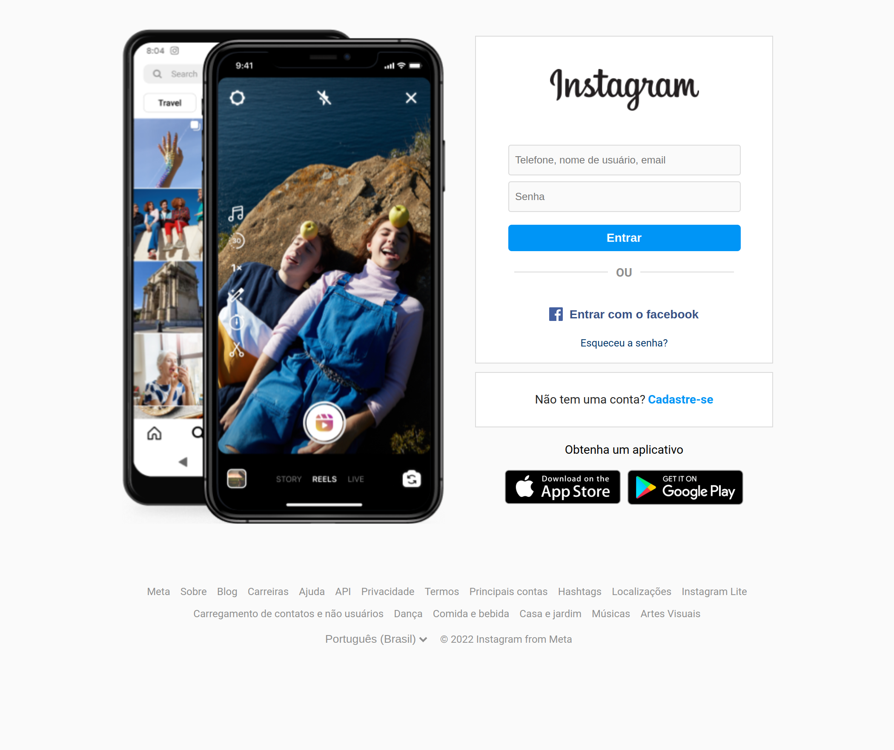
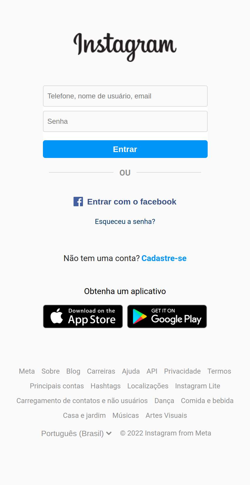

<h1 align="center">Recriando a Interface de login do Instagram Digital Innovation One</h1>

Curso do Bootcamp Impulso Javascript Evolution da <a href="https://web.dio.me/home" target="_blank">Digital Innovation One</a>

 <a href="#objetivo">Objetivo</a> •
 <a href="#preview">Preview</a> •
 <a href="#tecnologias">Tecnologias utilizadas</a> • 
 

<h3 id="objetivo">🔖 Objetivo</h3>

🚀 O projeto desenvolvido é um desafio para o  Curso do Bootcamp Impulso Javascript Evolution da <a href="https://web.dio.me/home" target="_blank">Digital Innovation One</a>. O objetivo é  reconstruir a página de login do Instagram. Para isso, é recomendado o uso de CSS com Flexbox, uma das abordagens de posicionamento de elementos mais utilizadas quando se trata de responsividade. 

  <h3 id="preview">Screenshots das telas</h3>
  <h2>:camera_flash: Desktop</h2>
  
    
  <h3 align="left" >:iphone: Mobile</h3>
  

<h3 id="tecnologias">⚡ Tecnologias utilizadas</h3>

- HTML5
- CSS3
- Clean CSS CLI

## 🦄 Autor 

<table>
  <tr>
    <td align="center">
      <a href="https://github.com/Ariane-Brum">
          
        
          <b>Ariane Brum</b>
        
      </a>
    </td>
  </tr>
</table>
